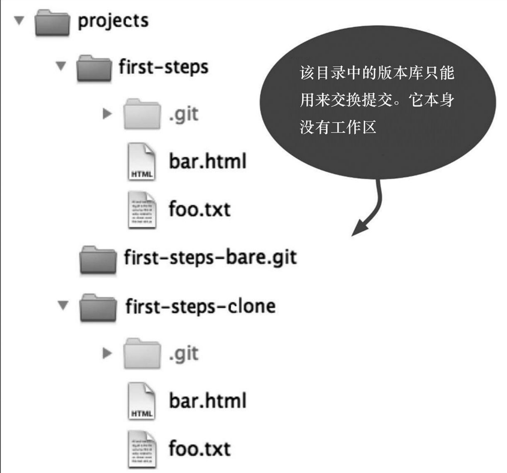
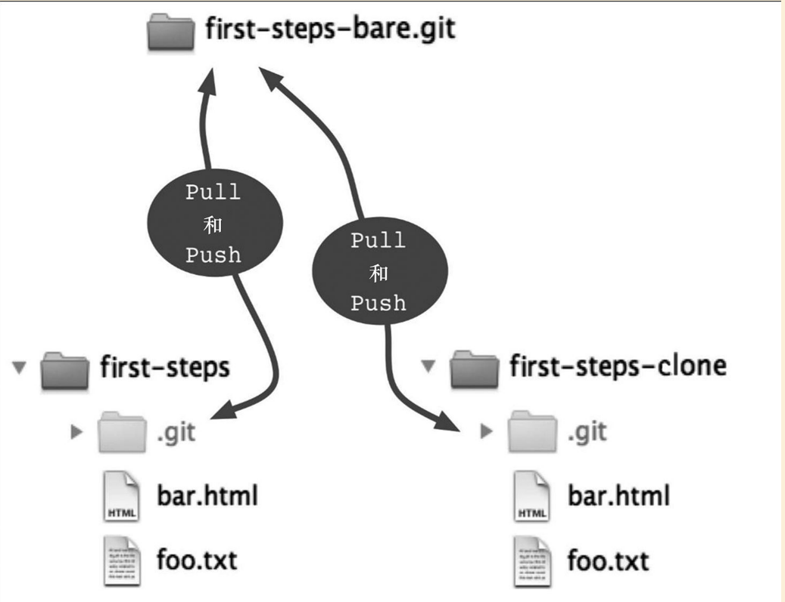
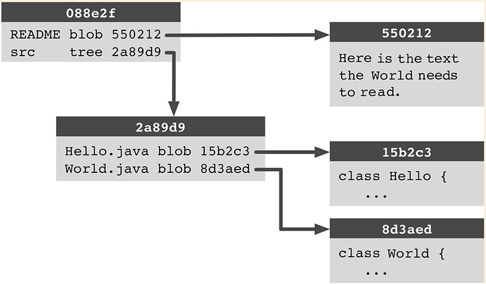
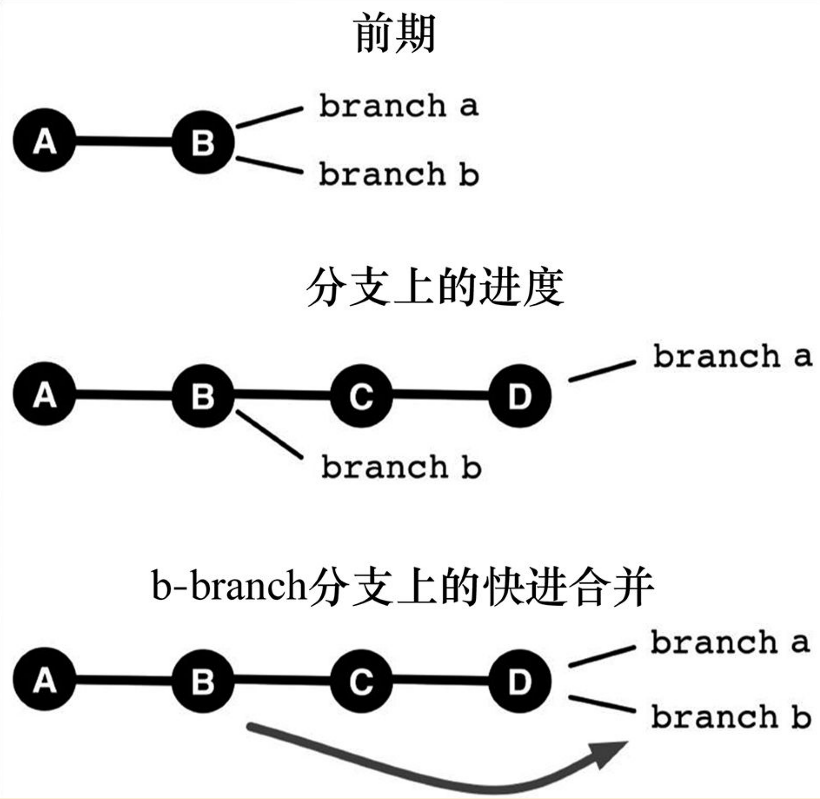

# Git学习指南


[git飞行规则](https://github.com/k88hudson/git-flight-rules/blob/master/README_zh-CN.md)


## git的协作功能


版本库：一个高效的数据存储结构，由以下部分组成

- 文件（blob）：即包含文本也包含了二进制数据，这些数据将不以文件名的形式作为存储
- 目录（Tree）：目录中保存的是与文件名相关联的内容，其中也会包含其他目录
- 版本（commit）：每一个版本所定义的都是相应目录的某个可恢复的状态。

创建共享版本库-》裸版本库（bare repository）？作用是什么？



使用裸版本库的好处




```shell
git commit --interactive #开启交互模式
```


. gitignore文件中的条目只能影响那些当前还未交由Git来管理的文件。如果其中的某个文件已经被现有版本包含，那么它一样可以通过**add**命令被注册到下次提交中。**如果我们想忽略一个已经被版本化的文件，可以通过update-index命令的-assume-unchanged选项来做到这一点**


存储栈（stash stack)：把工作区和暂存区的修改保存在缓存区中。

```shell
git stash
```

--------

Git的核心是**一个对象数据库**

Git主要由两个层面构成：

1. 顶层结构：我们所使用的命令，例如log\reset\commit等。也被称为瓷质命令
2. 底层结构：被称为管道，一组带有少量选项的简单命令，瓷质命令就是以此为基础构建出来的。

```shell
git hash-object -w hello.txt #将其作为一条记录插入到该对象数据库中
28cf67640e502fe8e879a863bd1bbcd4366689e8 #存储对象的键值
```



git存储的特性：

- 相同数据只存储一次
- 压缩相似内容：git gc 用于清理版本库，移除所有不属于当前分支的提交对象
- 历次提交也被存储在对象数据库中，它们的格式很简单

```shell
#逐行打印源头信息
> git blame -M -C -C -C test.txt
```

Reflog： git 会 记录 我们 在 每次 提交 中 对分 支 指针 所做 的 所有 修改。 如果 你想 恢复 某个 不小心 删除 的 分支， 这是 非常 有用 的 工具。


快进 合并 的 优点 是它 能 简化 版本 库 的 历史 记录 并使 其 保持 线性 发展。 而 缺点 则是 我们 不能 根据 已经 合并 过 的 历史 记录 来看 版本 库 的 这一 发展。 正是 因为 它 存在 这样 的 缺点， 我们 才 需要 在 本书 的 一些 工作 流 中 使用-- no- ff 选项， 以 强制 其 产生 一次 新的 提交。




