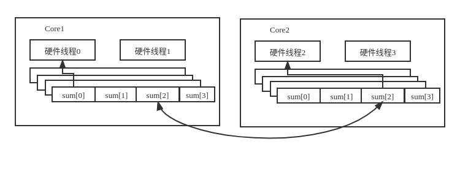

# OpenMP核心技术指南

随着摩尔定律和丹纳德微缩定律的终结，在满足功耗约束的前提下，**如何有效利用集成元器件成为摆在计算机体系结构设计者面前的重大挑战**，多核化，以加速器为基础的处理器核心的异构化以及片上存储层次的多级化形成了多种多样的体系结构。

| 标准          | 重点                                       |
| ------------- | ------------------------------------------ |
| OpenMP1.0~2.5 | 聚焦并行性，集中式共享存储对称多处理器模型 |
| OpenMP3.0     | 聚焦不规则并行模式                         |
| OpenMP4.0~5.0 | 多样化异构体系结构                         |

> **Using OpenMP-the next step**

[实例代码]: http://ompcore.com/


### 并行计算

现代CPU通过指令分解为更小的微操作，并将其送入处理器流水线从而在指令层面达到并行。由于控制单元跟踪微操作之间的依赖关系，因此他们可以并行执行，甚至不按顺序执行，却依旧能生成与原始顺序指令流相同的结果。这种形式的结果被称为超标量执行。

**并行性定义了操作可以以任何顺序执行（即它们是无序的），并行性使用多个硬件元件以使操作在同一个时间运行**

*通过硬件的并行执行，允许同时执行并发任务*

各类系统：分布式内存集群、可编程GPU、从单一指令流驱动多个数据元素的向量单元（SIMD）和多处理器计算机，OpenMP对除了分布式内存集群外的上述系统都有效。


**区分GPGPU与CPU编程的最基本问题是吞吐量与延迟**

高级的分布式内存机器的编程系统是基于单向通信、分区全局地址空间（pgas）和map-reduce框架

操作系统对线程进行调度，在一个系统中，线程比处理器多得多，这样，如果一个线程在等待一些高延迟事件（如文件访问）时被阻塞，其他准备执行的线程就可以交换进来使用可用的处理器。

OpenMP能够匹配围绕**嵌套循环组织的程序和利用共享内存的任务级程序**，而对分布式内存架构和**具有硬件实时约束的应用**来说，它不是一个好的选择


### 性能语言

> cpu时间：cpu频率乘以cpu在执行程序时消耗的周期数
>
> 墙钟时间：由计算机外部时钟测量的时间，即“墙上”的时钟

> **FLOPS:每秒执行的浮点运算**
>
> **OPS：每秒执行的操作**
>
> **IPS：每秒执行的指令**

并行计算的一个核心问题：了解性能如何随着处理器数量的增加而提升
$$
T_p=a \times T_s + (1-a) \times \frac{T_s}{P}
$$

$$
Speedup = \frac{T_s}{T_p} = \frac{1}{a+\frac{(1-a)}{P}} 
$$
P趋向无穷大的时候
$$
speedup = \frac{1}{a}  
$$
a为串行比例

> 如果有90%的代码可以并行，那么串行比例就是10%，无论使用多少处理器，都不可能做到比10更好的加速比

一个好的经验法则：**良好的扩展性要求串行比例比阿姆达定律所建议的极限小一个数量级**

如果串行比例a不是常熟会怎样？如果它是问题大小N的递减函数呢？这意味着加速比现在是P和N的函数
$$
speedup(P,N)=\frac{T_s}{T_p}=\frac{T_s}{a(N)+\frac{(1-a(N)) \times T_s}{P}}
$$
负载均衡：

- [ ] 显示与自动：是由程序员计算出一个固定的公式来生成负载均衡？还是在计算过程中自动出现负载均衡？
- [ ] 静态与动态：工作的分解和安排执行的方式在编译时是固定吗？还是在程序运行时动态发生？

- 显示、静态
- 显示、动态
- 自动、动态
- 自动、静态

用roofline模型理解硬件：

- [ ] 算术强度是指程序执行的浮点运算次数（Flops）与支持这些运算所需的数据移动的比率

**从本质来讲，用roofline模型引导一条优化路径，让代表你的性能的“图上的点”向上、向右移动**

### 什么是OpenMP

通用核心：

| OpenMP编译指令、函数或子句 | 概念                                       |
| -------------------------- | ------------------------------------------ |
| #progma omp parallel       | 并行区域、线程组、结构化块和跨线程交错执行 |
| #pragma omp paraller for | 组合式并行共享循环构造，创建一个线程组，切分循环 
| #pragma omp paraller for reduction(op:var)                          |  归约字句                                          |
| #pragma omp for reduction (+:sum) schedule(dynamic)                           |   调度                                         |
| #pragma omp for nowait                        | 无需等待                                           |
| #pragma omp parallerl shared(B,C)                           |  共享子句                                          |
| #pragma omp parallerl for private(tmp)                           | 私有变量                                           |
| #pragma omp task                           |   任务                                         |
| #pragma omp single                           | single构造                                           |
|     |  


## OpenMP通用核心

openMP程序中的许多错误来自管理数据的错误

### 线程和OpenMP编程模型
> 修改代码的最小干扰方式是通过编译器指令

由于与指令相关联的代码块中的代码将变成一个函数

>指令和结构化的组合称为构造，编译器指令定义了OpenMP编译器在编译程序时进行的转换（构造：一个指令加上编译单元中包含该指令的直接可见的代码，区域：构造中的代码，加上从构造结构化调用函数中的任何代码）


OpenMP规范定义的一些元素：

+ 编译器指令
+ 运行时库例程
+ 环境变量


```
cmake_minimum_required(VERSION 3.12)
project(OpenMP_MPI)

set(CMAKE_CXX_STANDARD 14)

OPTION (USE_OpenMP "Use OpenMP to enamble <omp.h>" ON)

find_package(OpenMP REQUIRED)
if (OPENMP_FOUND)
    if(APPLE)
        include_directories("${OPENMP_INCLUDES}")
        link_directories("${OPENMP_LIBRARIES}")
    endif()
    set (CMAKE_C_FLAGS "${CMAKE_C_FLAGS} ${OpenMP_C_FLAGS}")
    set (CMAKE_CXX_FLAGS "${CMAKE_CXX_FLAGS} ${OpenMP_CXX_FLAGS}")
    # set (CMAKE_EXE_LINKER_FLAGS "${CMAKE_EXE_LINKER_FLAGS} ${OpenMP_EXE_LINKER_FLAGS}")
endif(OPENMP_FOUND)

add_executable(OpenMP_MPI hello.cpp)

target_link_libraries(OpenMP_MPI ${OPENMP_LIBRARIES})
```

```
#include <stdio.h>
#include <omp.h>

int main(int argc, char *argv[]){

    omp_set_num_threads(4);

    #pragma omp parallel 
    {
        int ID = omp_get_thread_num();
        printf("hello,world  %d\n" , ID);
    }

    return 0;
}
```
使用任何语言（不仅仅是OpenMP）编码，线程关键部分都是确保没有数据竞争。


SPMD设计模式
+ 启动多个执行相同代码的线程
+ 每一个线程确定其ID和线程组中的线程数
+ 根据ID和线程组中的线程数在线程之间分配工作

按周期分布划分循环迭代：0号线程执行0,4,8,12，... 1号线程执行1,4,9,13，...等等


基于循环的块状分解：0号线程执行一块数据（连续数据）

-----

例子来说明加速比
```
/*串行执行程序*/
#include <iostream>
#include <omp.h>

static long num_steps = 100000000;
double step;

int main(int argc, char **argv){
    int i;
    double x, pi, sum = 0.0;
    double start_time, run_time;

    step = 1.0 /(double)num_steps;

    start_time = omp_get_wtime();

    for(i = 0; i < num_steps; i++){
        x = (i+0.5)*step;
        sum += 4.0 / (1.0 + x*x);
    }
    pi = step*sum ;
    run_time = omp_get_wtime() - start_time;
    std::cout << "pi = " << pi << " steps: " << num_steps << " secs: " << run_time << std::endl;

    return 0;
}
```
```
/**虽然使用了并行，但是存在多核之间存在伪共享的问题，cache的抖动问题**/
#include <iostream>
#include <omp.h>

#define NTHREADS 4

static long num_steps = 100000000L;
double step;


int main(int argc, char **argv){

    int i,j,actual_nthreads = 0;
    double pi, start_time,run_time;
    double sum[NTHREADS] = {0};

    step = 1.0 / (double)num_steps;
    start_time = omp_get_wtime();

    omp_set_num_threads(NTHREADS);

    #pragma omp parallel
    {
        int i;
        int id = omp_get_thread_num();
        int numthreads = omp_get_num_threads();
        double x;
        
        if(id == 0){
            actual_nthreads = numthreads;
        }
        for(i = id; i < num_steps; i+=numthreads){
            x = (i + 0.5) * step;
            sum[id] += 4.0 / (1.0 + x*x);
        }
    } // end of parallel region

    pi = 0.0;
    for(i = 0; i < actual_nthreads; ++i){
        pi += sum[i];
    }
    pi = step * pi;
    run_time = omp_get_wtime() - start_time;
    std::cout << "pi = " << pi << " steps: " << num_steps << " secs: " << run_time << std::endl;
    
    return 0;
}
```
```
/**带有填充数据，解决伪共享的问题**/
#include <iostream>
#include <omp.h>

#define NTHREADS 4
#define CBLK 8

static long num_steps = 100000000L;
double step;


int main(int argc, char **argv){

    int i,j,actual_nthreads = 0;
    double pi, start_time,run_time;
    double sum[NTHREADS][CBLK] = {0};

    step = 1.0 / (double)num_steps;
    start_time = omp_get_wtime();

    omp_set_num_threads(NTHREADS);

    #pragma omp parallel
    {
        int i;
        int id = omp_get_thread_num();
        int numthreads = omp_get_num_threads();
        double x;
        
        if(id == 0){
            actual_nthreads = numthreads;
        }
        for(i = id; i < num_steps; i+=numthreads){
            x = (i + 0.5) * step;
            sum[id][0] += 4.0 / (1.0 + x*x);
        }
    } // end of parallel region

    pi = 0.0;
    for(i = 0; i < actual_nthreads; ++i){
        pi += sum[i][0];
    }
    pi = step * pi;
    run_time = omp_get_wtime() - start_time;
    std::cout << "pi = " << pi << " steps: " << num_steps << " secs: " << run_time << std::endl;
    
    return 0;
}
```

这个例子说明伪共享的说明示意图

| 线程数量 | 串行时间 | OpenMP时间 | 缓存优化openMP时间| 
| ------ |-------- | ----------|   ------------|
|   4     | 1.10826 | 0.887507|  0.329924|
|  加速比 |          |      1.25| 3.48|

用了4个线程，实现了3.8的加速比


### 并行化循环

共享工作循环构造：在一个线程组中拆分循环迭代的指令，对于大多数程序员来说，这个构造是openMP的精髓

#### 归约

```
//串行规约的例子，循环通过变量ave出现循环携带依赖性
int i 
double ave = 0.0, A[N];
Init(A,N);
for(i = 0; i < N; ++i){
    ave += A[i];
}
ave /= N;
```
*reudction(op:var)*,对于列表中的每个变量（归约变量），系统将为一个线程创建一个同名的私有变量，在线程完成构造并退出barrier之前，利用归约字句op将每一个线程的归约变量的本地副本合并在一起产生最终的归约值。

#### 调度
+ 静态调度
   + 小的分块意味调度将有更多的分块可以使用
   + 更大的分块可以很好地与缓存层次结构配合
   + 当循环迭代的运行时间大致相同时，静态调度能够很好的适用于这种情况
+ 动态调度

静态在以下两种情况会遇到困难：
+ 每次循环迭代的工作量可能有很大的变化
+ 系统的处理器以不同的速度运行

使用openMP的挑战之一**均衡各个线程的负载**，最佳的调度是一个考虑缓存的数据复用、内存预取、向量化、以及算法均衡所需求的复杂混合体


-----
经验之谈
+ 找到计算密集型的循环
   + (概要分析工具)[https://www.openmp.org/resources/openmp-compilers-tools/]

+ 检查这些循环，是否基本上可以并行执行？
   + 测试循环迭代是否真正独立的一个有用的技术是通过交换起始和结束条件来反向执行循环，如果反向和正向结果相同，那么很可能没有循环携带的依赖
+ 这时候可以使用 **#pragma omp parallar for** 


### OpenMP数据环境
**基本规则：在并行构造之前声明的变量在线程之间共享，而在并行构造内部声明的变量是线程是私有变量**

openMP的存储属性：
+ 私有
+ 共享

OpenMP是一个共享内存编程模型，大多数变量都是默认共享的

**理解一个OpenMP程序，需要能推断出变量在区域内是共享的还是私有的（比如并行和共享工作循环区域），管理变量如何跨区域边界移动是编写正确的openMP程序的基础**


### OpenMP任务

任务的必要性：
+ 不规则的问题很多，无法很好的循环，无法用规则迭代空间来表示
+ task是openMP3.0才开始支持

```
#串行链表程序
p=head;
while(p!=NULL){
    processwork(p);
    p = p->next;
}
```
#### 显示任务

```
//两个线程各产生两个任务
 omp_set_num_threads(2);

#pragma omp parallel share(HorT, dead_or_alive)
{
    #pragma omp task
    {
        double val = waitAbit();
        dead_or_alive = HorT;
    }
    #pragma omp task
    {
        double val = waitAbit();
        dead_or_alive = !HorT;
    }
}
```

#### single构造

任务的缺省数据作用域：
+ 数据绑定的是任务，而不是遇到任务的线程，因为无法控制那个线程执行哪个任务
+ 如果一个变量在遇到任务时是私有的，那么它将被默认为fristprivate

```
#pragma omp parallel
{
    #pragma omp single
    {
        p = listhead;
        while(p)
        {
            #pragma omp task firstprivate(p)
            {
                process(p);
            }
            p - p->next;
        }
    }
}
```


#### 利用任务的基础设计模式


### OpenMP内存模型


### 同步和OpenMP内存模型
