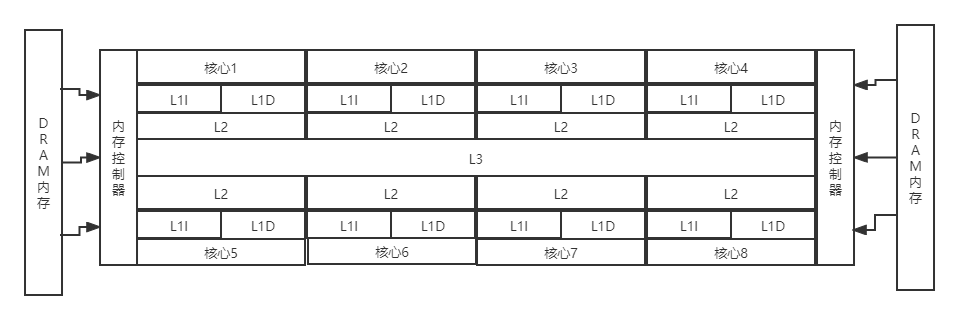
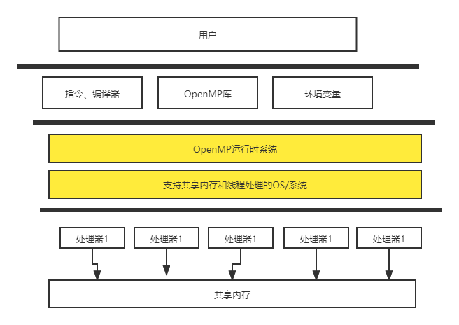

# OpenMP核心技术指南

随着摩尔定律和丹纳德微缩定律的终结，在满足功耗约束的前提下，**如何有效利用集成元器件成为摆在计算机体系结构设计者面前的重大挑战**，多核化，以加速器为基础的处理器核心的异构化以及片上存储层次的多级化形成了多种多样的体系结构。

| 标准          | 重点                                       |
| ------------- | ------------------------------------------ |
| OpenMP1.0~2.5 | 聚焦并行性，集中式共享存储对称多处理器模型 |
| OpenMP3.0     | 聚焦不规则并行模式                         |
| OpenMP4.0~5.0 | 多样化异构体系结构                         |

> **Using OpenMP-the next step**

[实例代码]: http://ompcore.com/

### 并行计算

现代CPU通过指令分解为更小的微操作，并将其送入处理器流水线从而在指令层面达到并行。由于控制单元跟踪微操作之间的依赖关系，因此他们可以并行执行，甚至不按顺序执行，却依旧能生成与原始顺序指令流相同的结果。这种形式的结果被称为超标量执行。

**并行性定义了操作可以以任何顺序执行（即它们是无序的），并行性使用多个硬件元件以使操作在同一个时间运行**

*通过硬件的并行执行，允许同时执行并发任务*

各类系统：分布式内存集群、可编程GPU、从单一指令流驱动多个数据元素的向量单元（SIMD）和多处理器计算机，OpenMP对除了分布式内存集群外的上述系统都有效。

**区分GPGPU与CPU编程的最基本问题是吞吐量与延迟**

高级的分布式内存机器的编程系统是基于单向通信、分区全局地址空间（pgas）和map-reduce框架

操作系统对线程进行调度，在一个系统中，线程比处理器多得多，这样，如果一个线程在等待一些高延迟事件（如文件访问）时被阻塞，其他准备执行的线程就可以交换进来使用可用的处理器。

OpenMP能够匹配围绕**嵌套循环组织的程序和利用共享内存的任务级程序**，而对分布式内存架构和**具有硬件实时约束的应用**来说，它不是一个好的选择

### 性能语言

> cpu时间：cpu频率乘以cpu在执行程序时消耗的周期数
>
> 墙钟时间：由计算机外部时钟测量的时间，即“墙上”的时钟

> **FLOPS:每秒执行的浮点运算**
>
> **OPS：每秒执行的操作**
>
> **IPS：每秒执行的指令**

并行计算的一个核心问题：了解性能如何随着处理器数量的增加而提升
$$
T_p=a \times T_s + (1-a) \times \frac{T_s}{P}
$$

$$
Speedup = \frac{T_s}{T_p} = \frac{1}{a+\frac{(1-a)}{P}} 
$$
P趋向无穷大的时候
$$
speedup = \frac{1}{a}  
$$
a为串行比例

> 如果有90%的代码可以并行，那么串行比例就是10%，无论使用多少处理器，都不可能做到比10更好的加速比

一个好的经验法则：**良好的扩展性要求串行比例比阿姆达定律所建议的极限小一个数量级**

如果串行比例a不是常熟会怎样？如果它是问题大小N的递减函数呢？这意味着加速比现在是P和N的函数
$$
speedup(P,N)=\frac{T_s}{T_p}=\frac{T_s}{a(N)+\frac{(1-a(N)) \times T_s}{P}}
$$
负载均衡：

- [ ] 显示与自动：是由程序员计算出一个固定的公式来生成负载均衡？还是在计算过程中自动出现负载均衡？
- [ ] 静态与动态：工作的分解和安排执行的方式在编译时是固定吗？还是在程序运行时动态发生？

- 显示、静态
- 显示、动态
- 自动、动态
- 自动、静态

用roofline模型理解硬件：

- [ ] 算术强度是指程序执行的浮点运算次数（Flops）与支持这些运算所需的数据移动的比率

**从本质来讲，用roofline模型引导一条优化路径，让代表你的性能的“图上的点”向上、向右移动**

### 什么是OpenMP

通用核心：

| OpenMP编译指令、函数或子句 | 概念                                       |
| -------------------------- | ------------------------------------------ |
| #progma omp parallel       | 并行区域、线程组、结构化块和跨线程交错执行 |
|                            |                                            |
|                            |                                            |
|                            |                                            |
|                            |                                            |
|                            |                                            |
|                            |                                            |
|                            |                                            |
|                            |                                            |

## OpenMP通用核心

### 线程和OpenMP编程模型

### 并行化循环

### OpenMP数据环境

### OpenMP任务

### OpenMP内存模型

### 同步和OpenMP内存模型
