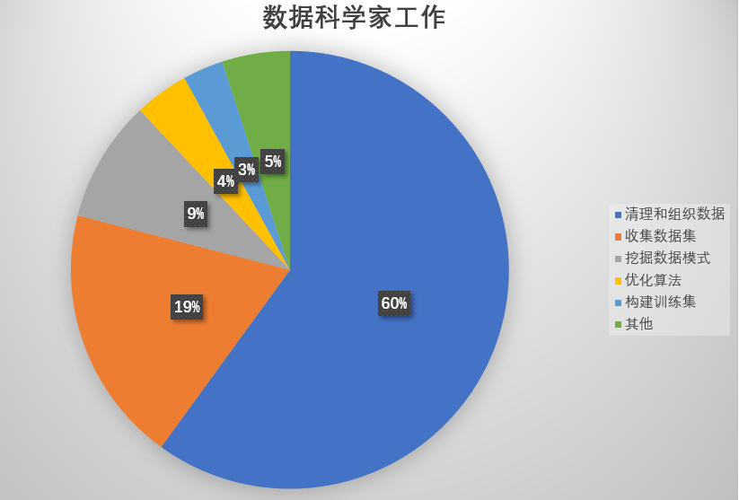
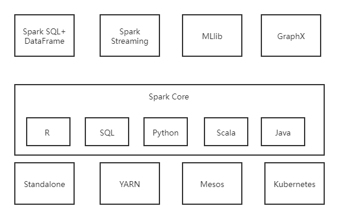
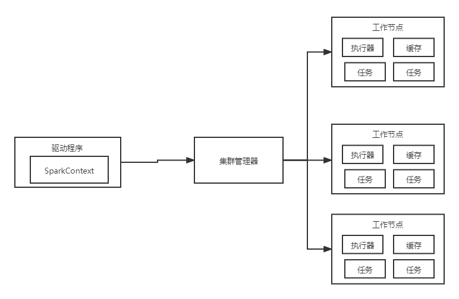

# Spark和Spark MLib介绍

> 基于spark的下一代机器学习 XGboost、LightGBM、SparkNLP与Keras分布式深度学习实例

人工智能>机器学习>深度学习

> Elements of Statistical Learning 2nd ed
>
> An troduction to statistical learning

## spark介绍

**开发spark是为了解决Hadoop原始数据处理框架MapReduce的局限性，那么局限性是指那些？**

​                                                                                     生态系统

​                                                                                             spark架构

> Alluxio 堆外内存存储？

## spark的环境的安装

## spark的demo-example

