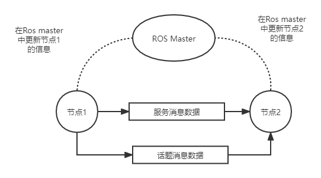
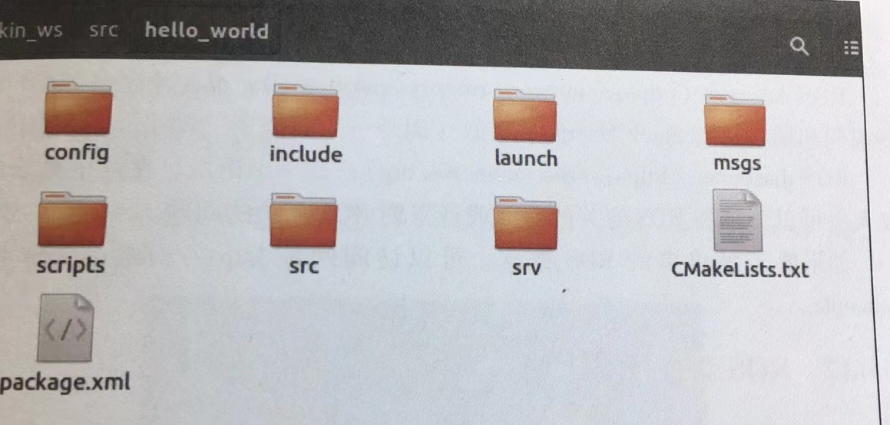

# ros系统入门学习

[TOC]


## 介绍

ros是一个运行在linux上的中间件，(ros)[https://www.ros.org]实际上相当于一个软件工具集，采用了分布式架构，通信框架是其主要组成部分，可将多个单个单独设计的进程（节点）组合起来并同时运行。


### 先验知识

安装[ubuntu](http://release.ubuntu.com)，通过usb进行安装：使用[UNetbootin](http://unetbootin.github.io/)的工具把系统镜像烧录到优盘中，或者使用[rufus](https://github.com/pbatard/rufus)工具。

```c++
/
├── media 可移动媒介挂载的目录
├── etc 系统配置文件
├── bin 系统应用程序
├── sbin
├── lib 类似于windows中dll文件存放目录
├── boot 系统启动所需的文件
├── opt 可选安装程序的存放位置
├── sys 系统信息的文件
├── mmt 已经挂载的分区
├── usr
│   ├── bin 
│   └── lib
├── var
│   └── log  应用程序生成的日志文件
└── home

```

 安装c/c++编译器

```c++
sudo apt-get install build-essential manpages-dev
sudo apt-get install gcc g++
```

嵌入式设备一般都通过usb或者uart进行通信(重要)[https://learn.sparkfun.com/tutorials/serial-communication]


机器人编程所需的一些特性：

- 线程化：多个任务，多个传感器
- 底层设备控制：GPIO（通用输入/输出）引脚，串口、并口、usb、spi、I2C
- 进程间通信
- 性能


## 环境安装

ros编程框架提供如下功能：

- 进程间的消息传递接口
- 与操作系统类似的特性
- 高级编程语言的支持和工具链
- 第三方库的可用性：opencv pcl等等
- 通用算法：slam等等
- 编程实现的简便性
- 生态系统
- 大量工具和模拟器：(rviz)[https://wiki.ros.org/rviz] (Gazebo)[http://gazebosim.org]

```c++
ros = 框架 + 工具 + 功能 + 生态系统
```

ros 不是一个真正的操作系统，它需要依附于一个宿主操作系统来工作

[ros安装教程]: http://wiki.ros.org/cn/kinetic/Installation/Ubuntu

```
#配置ubuntu软件源
# main ubuntu官方支持的免费、开源的软件源
# Universe 社区维护的免费、开源的软件源
# Restrited 私有的设备驱动程序源
# Multiverse 软件源中的软件受到版权和法律的保护

```


## ros的架构和概念




当程序启动时，节点会和 名为ros master的ros程序通信，节点将所有信息发给ros master 包括它发送和接收到消息类型，本节点路由信息等。

发布节点：发送消息的节点

订阅节点：接受消息的节点

ros消息：不同类型的数据

ros话题：这些消息通过一种类似数据总线或者路径标识的媒介进行传播，每一个topic都有自己的名字

如果节点1发送某一个名为A的数据，而节点2正好订阅该消息，那么ros master就向两个节点广播彼此的节点信息（而不是消息），以帮助两个节点相互通信


### ros文件系统

- 程序包：ros软件的独立单元，所有的源代码、数据文件、生成文件、依赖包和其他文件都在程序包中
- 元包：记录服务于同一个应用的一组程序包的相关信息，它不包含源代码文件或者数据文件，ros元包只提供分组功能
- 包清单：ros程序包里的xml文件
- 代码库：共享一个版本库控制系统一组ros程序包的集合
- 消息类型：定义新的ros消息类型
- 服务类型：可以自己定义，存放在程序包中的srv文件夹中



### ros计算的概念

ros节点（node)：使用ros API进行运算的进程

ros主机（master）：连接ros节点的媒介程序

ros参数服务器：通常与ros master一起运行的一个程序

ros话题（topic）：“总线‘

ros消息（message）：消息基本通过话题传送

ros服务（Service）：有这请求\应答的机制

ros数据包（bags）：一种可用于保存和查看ros话题历史记录的有效方式，可用于机器人中记录数据以便离线处理


### ros命令行工具

```shell
#roscore命令，启动ros master、参数服务器和日志节点
roscore
# 检查ros版本
rosversion-d
```

```shell
#系统中正在运行的节点列表
rosnode list
```

```shell
#提供系统中与当前话题发送和订阅相关的情况
rostopic list
```

```shell
#打印这个话题信息
rostopic echo /chatter
# 想话题发布数据 rostopic pub topic_name msg_type data
rostopic pub /hello std_msgs/String "hello"
```

```shell
#列出加载在参数服务器上的参数
rosparam list
#设置参数的命令：rosparam set parameter_name value
rosparam set hello "Hello"
#获取参数的命令 rosparam get parameter_name
rosparam get hello
```

```shell
#使用roslaunch命令启动一个launch文件，ros launch文件是一个xml格式的文件，roslaunch命令可以自动执行roscore命令
# ros_launch ros_pkg_name luanch_file_name
ros_launch roscpp_tutorials talker_listener.launch
#运行ros节点，使用rosrun命令 rosrun ros_pkg_name node_name
rosrun roscpp_tutorials talker
```


### ros图形用户接口：Rviz和Rqt

```shell
roscore
rosrun rivz rviz
```

```shell
roscore
rosrun rqt_gui rqt_gui
```


## ros编程环境

使用ros提供的一些内置函数来编写ros应用程序


### ros的工作空间

创建ros工作空间，又称为catkin工作空间

```shell
mkdir -p ~/catkin_ws/src
cd catkin_ws/src
# 这条命令初始化一个新的ros工作空间，如果不初始化工作空间就不能正确地创建、编译和链接程序包
catkin_init_workspace
# 编译工作空间的命令
cd ~/catkin_ws
catkin_make #生成catkin工作空间的命令
```

```shell
#形成的目录结构
catkin_ws
├── src 代码存放的地方
├── build 存放一些中间编译文件和中间缓存文件
├── devel 编译成功后，可执行文件存放的地方，其中还有一些脚本文件
└── install 安装目录

```


创建工作空间之后，还需要向系统添加工作空间的环境变量，这就意味着一定要设定工作空间的系统路径，这样的工作空间中的程序包才可以被访问到

```shell
gedit ~/.bashrc
#在末尾增加
source ~/catkin_ws/devel/setup.bash
```


### catkin编译系统

ros使用自己的一套编译系统，即catkin编译系统，它是CMake编译系统和一些Python脚本定制的一套特殊的编译系统，

`为啥不用直接使用cmake呢？`

(catkin编译系统)[http://wiki.ros.org/catkin/conceptual_overview]


### 创建ros程序包

```shell
# catkin_create_pkg ros_package_name package_dependencies
cd ~/catkin_ws/src
catkin_create_pkg hello_word roscpp rospy std_msgs
```

.
├── CMakeLists.txt
└── hello_word
    ├── CMkelists.txt
    ├── include
    │   └── hello_world
    ├── package.xml
    └── src


### 使用ros客户端

了解ros相关的概念，如话题、服务、消息等，那么如何编程实现这些概念？--》使用ros客户端库，实现一系列ros概念所对应功能的代码

- roscpp：c++ ros客户端库
- rospy：python 客户端库

#### 编写ros节点的步骤


## 练习demo


### Hello World

```shell
#一个终端
roscore
```

```shell
#另一个终端
rosrun roscpp_tutorials talker
```

```shell
#输出 /chatter
rostopic list
```

```shell
rosrun roscpp_tutorials listener
```

或者

```shell
roslaunch roscpp_tutorials talke_listener.launch
```


### turlesim

```shell
roscore
```

```shell
rosrun turtlesim turtlesim_node
```

```shell
rostopic list
```

```shell
rosservice list
```

```shell
rosparam list
```


#### 移动小乌龟

```shell
rosrun turtlesim turtle_teleop_key
```

```shell
rosrun turtlesim draw_square
```


