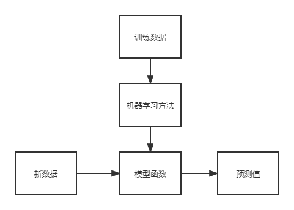

## 概述

每一个时代必须有核心物质作为载体：工业时代的发动机、信息时代的通用处理器、智能时代的智能计算系统

人工智能的主要三个方法：

- 行为主义
- 符号主义
- 连接主义

深度学习不一定是通向强人工智能的终极道路，它更像是一个能帮助我们快速爬到二楼、三楼的梯子，但是顺着梯子我们爬不到月球。存在的局限

- 泛化能力有限
- 缺乏推理能力
- 缺乏可解释性

**硬件（通用CPU和智能芯片的异构系统）+智能计算编程环境（编程框架+编程语言）=智能系统**

## 神经网络基础

## 深度学习

卷积网络的核心思想：

- 局部连接
- 权重共享

**基于卷积神经网络的图像目标检测算法**

## 编程框架使用

tensorflow

pytoch

mxnet

## 编程框架机理

**数据流系统高层编程模型的基本思想？**期待用户通过简单的数据流编程来实现不同形态、不同规模（异构）设备上的高效开发和执行

- 高性能
- 易开发
- 可移植

计算图执行：

- 计算图剪枝：根据输入输出列表在完整计算图上进行剪枝操作，从而得到执行所需的最小依赖计算图
- 计算图分配：在最小依赖计算图上，根据特定设备分配原则及操作的设备约束对计算图中的节点进行设备分配
- 计算图优化：对计算图做系列优化操作，以提高计算图的运行效率
- 计算图切分：根据划分结果，对计算图进行切分，从而为每个设备创建自身的计算子图

## 深度学习处理器原理

计算机体系图结构设计关注两个方面：
+ 能效：单位功耗内能做多少运算
+ 通用性：覆盖多大的应用

设计深度学习处理器的步骤：
+ 分析算法的**计算特性**和**访存特性**
+ 确定微体系结构，包括**指令集、流水线、运算部件、访存部件**

> 直观来说，一个芯片里能放的运算器数量是和芯片面积成比例增长的，而一个芯片的访存带宽是和芯片周长成比例增加的，它们的增长速度是不匹配的，这就是著名的“内存墙”
> 从而目前有了新的技术-> hbr 通过垂直方向的叠加，增加带宽的读写能力

性能调优的主要工作：
+ 充分利用近端存储（使用片上缓存）
+ 充分利用张量运算器（张量化）
+ 充分消减计算量，节省存储空间，包含算法优化和常数预处理
+ 充分利用多核并行（计算任务拆分）等

## 深度学习处理器架构

## 智能编程语言

