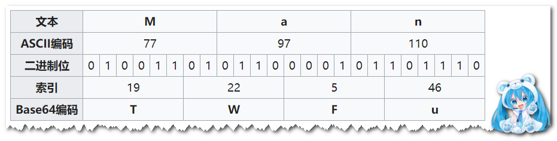

# 深入理解序列化与反序列


## 技术基础


### 计算机编码

计算机的存储空间按照字节来划分，理论上任何类型的数据都可以从任意位置开始，但实际情况时不同类型的数据需要按照一定的规则排布在指定内存地址上（一般由编译器指定）（c++标准中定义的对齐以及求解对齐的运算符）。排布规则很重要的一条便是**字节对齐**。

如果字节对不起，则会出现内存访问性能降低的问题

字符编码：

- 英文字符集编码--ASCII
- 中文字符集编码--GBK
- unicode字符集编码
  - utf-32
  - utf-16
  - utf-8


### 字符编码


### Base64编码

Base64 是一种基于 64 个可打印字符来表示二进制数据的表示方法。由于 2^6 = 64，所以每 6 个比特为一个单元，对应某个可打印字符。3 个字节有 24 个比特，对应于 4 个 Base64 单元，即 3 个字节可由 4 个可打印字符来表示。它可用来作为电子邮件的传输编码。在 Base64 中的可打印字符包括字母 `A-Z`、`a-z`、数字 `0-9` 和 `+`, `/`。


#### 编码规则

- 对原始数据按6bit进行分割；如果当前所有bit长度不是6的倍数，则有剩余bit
- 对6bit进行高位补齐2个0，凑成8bit；在剩余bit前面补齐若干个0，凑成8bit
- 补齐后的每一个字节成为索引，最大值为00111111（63），最小值为00000000（0）
- 根据**索引表**，将索引替换成目标字符



```c++
#只是为了验证其的算法步骤。或者有其他的实现机制更高效
static const std::string base64_chars = "ABCDEFGHIJKLMNOPQRSTUVWXYZ"
        "abcdefghijklmnopqrstuvwxyz"
    "0123456789+/";

std::string base64_encode(const char* bytes_to_encode, unsigned int in_len) {
    std::string ret;
    int i = 0;
    int j = 0;
    unsigned char char_arry_3[3];
    unsigned char char_arry_4[4];

    while (in_len--) {
        char_arry_3[i++] = *(bytes_to_encode++);
        if (3 == i) {
            char_arry_4[0] = (char_arry_3[0] & 0xfc) >> 2;
            char_arry_4[1] = ((char_arry_3[0] & 0x03) << 4) + ((char_arry_3[1] & 0xf0) >> 4);
            char_arry_4[2] = ((char_arry_3[1] & 0x0f) << 2) + ((char_arry_3[2] & 0xc0) >> 6);
            char_arry_4[3] = char_arry_3[2] & 0x3f;

            for (i = 0; (i < 4); i++) {
                ret += base64_chars[char_arry_4[i]];
            }
            i = 0;
                
        }

    }
    if (i){
        for (j = i; j < 3; j++)
            char_arry_3[j] = '\0';

        char_arry_4[0] = (char_arry_3[0] & 0xfc) >> 2;
        char_arry_4[1] = ((char_arry_3[0] & 0x03) << 4) + ((char_arry_3[1] & 0xf0) >> 4);
        char_arry_4[2] = ((char_arry_3[1] & 0x0f) << 2) + ((char_arry_3[2] & 0xc0) >> 6);

        for (j = 0; (j < i + 1); j++)
            ret += base64_chars[char_arry_4[j]];

        while ((i++ < 3))
            ret += '=';

    }
    return ret;
}

```

#### 解码规则

- 根据索引表，将字符替换成所以，每一个索引为1个字节，对应8bit
- 将每个索引的前2个bit（值为00）去掉，剩下所有bit的长度为N
- 在小于等于N的范围内找到第一个最接近N且能被8整除的数M
- 如果N和M相等，则说明编码前的所有bit长度是6和8的倍数，长度为N的所有bit按照8bit切分完成解码
- 若是M<N，需要对长度为N的bit序列的最后一个6bit进行如下处理，去掉高位（N-M）个bit,剩余的M个bit按照8bit切分即可

```c++

static inline bool is_base64(unsigned char c) {
    return (isalnum(c) || (c == '+') || (c == '/'));
}

std::string base64_decode(const std::string& encoded_string) {
    size_t in_len = encoded_string.size();
    int i = 0;
    int j = 0;
    int in_ = 0;
    unsigned char char_array_4[4], char_array_3[3];
    std::string ret;

    while (in_len-- && (encoded_string[in_] != '=') && is_base64(encoded_string[in_])) {
        char_array_4[i++] = encoded_string[in_]; in_++;
        if (i == 4) {
            for (i = 0; i < 4; i++)
                char_array_4[i] = base64_chars.find(char_array_4[i]) & 0xff;

            char_array_3[0] = (char_array_4[0] << 2) + ((char_array_4[1] & 0x30) >> 4);
            char_array_3[1] = ((char_array_4[1] & 0xf) << 4) + ((char_array_4[2] & 0x3c) >> 2);
            char_array_3[2] = ((char_array_4[2] & 0x3) << 6) + char_array_4[3];

            for (i = 0; (i < 3); i++)
                ret += char_array_3[i];
            i = 0;
        }
    }

    if (i) {
        for (j = 0; j < i; j++)
            char_array_4[j] = base64_chars.find(char_array_4[j]) & 0xff;

        char_array_3[0] = (char_array_4[0] << 2) + ((char_array_4[1] & 0x30) >> 4);
        char_array_3[1] = ((char_array_4[1] & 0xf) << 4) + ((char_array_4[2] & 0x3c) >> 2);

        for (j = 0; (j < i - 1); j++) ret += char_array_3[j];
    }

    return ret;
}
```


### Varint编码

为了实现小整数高效编码，Varint编码被提出，因为以整数1为例，占用4个字节，而又价值的bit是最低位的一个bit，其他值为0的bit传输到目标系统都是无价值的


#### 编码规则

- 整数先和0x10取与，判断右移7位数后数值是否大于0
- 取整数最低7位，如果步骤1中结果大于0，最高位补1，否则在最高位补0，和最低7位凑成1个字节
- 整数执行右移7位


```c++
varint编码原理
对原始数字value进行7个bit划分为一个块(这个块就是字节)，每个块最高位的一个bit用来表示后面是否还有块，1表示还有，0表示没有。
举个例子(官网)：bin(300) = 100101100  按照7个bit一个划分就是[10][0101100], 然后排序[00101100][00000010]，最后计算最高位bit[10101100][00000010] 所以300可以只用两个块来表示。这样在二进制buffer中，只要碰到最高位bit为0的，那么它之前的块都是用来表示同一个数字

inline uint8_t* WriteVarint32ToArray(uint32_t value, uint8_t* target) {
    while (value >= 0x80) {	//因为7个bit最大只能标识0x7F, 如果value>=0x80表示后面必然还有一个块												
        *target = static_cast<uint8_t>(value | 0x80); //块的最高位bit设为1，用来标识后面还有块, 同时把7个bit复制到target这个块中
        value >>= 7;	//处理下一个块(7个bit)
        ++target;
    }
    *target = static_cast<uint8_t>(value); //最后一个块的值
    return target + 1;
}

varint正整数解码
把编码的逻辑反过来
inline bool ReadVarint32(const uint8_t* buffer, uint32_t* value) {
    uint32_t result = 0;
    int bitsize = 0;
    while ((*buffer) & 0x80) {	//判断后面是否还有块，利用了编码时计算的最高位bit是否为1
        result |= ((*buffer) ^ 0x80) << bitsize; //把最高位变成0，然后往左移bitsize位放置, bitsize是7的倍数，因为编码的时候7个bit为一组
        bitsize += 7;
        ++buffer;
    }
    result |= (*buffer) << bitsize;	//还原最高位，并且算出了答案
    *value = result;
    return result >= 0;
}
```


#### 解码规则

把编码的逻辑反过来


不足：对于小正整数，varint编码可以使用更少的字节来表示，但是对于大正整数以及负整数，需要字节超过了标准语言定义的字节数


### ZigZag编码

#### 编码规则

```c++
int intTozigZag(int n){
	return (n << 1) ^ (n >> 31)
}
```

- n << 1: 左移1位，最后1位变成0
- n >> 31: 符号位放到最后1位，如果是非负数，则全为0，若是是负数，则全为1
- 异或操作后可以看到，数据位全部反转，而符号位不变，移到最后1位

#### 解码规则

```c++
int zigzagToInt(int n){
	retun (n >> 1) ^ -(n &1);
}
```


### 初始序列化/反序列化

序列化\反序列化分为两种：

- IDL（interface description language）
  - IDL描述文件：按照一定的规则描述一定的数据结构
  - IDL文件编译器：根据IDL文件生成具有序列化或反序列化功能的代码文件
  - Stub/Skeletion代码：stub（客户端代码），skeletion（服务端代码）
- 非IDL，包括json，xml等：提供构造和解析的工具包就行


## 目前的技术

- java序列化
- json
- thrift
- protobuf
- arvo


## 技术性能对比


#### 技术特征的对比

| 维度             | json       | protobuf                       |
| ---------------- | ---------- | ------------------------------ |
| 是否IDL          | N          | Y                              |
| 生成代码         | N          | Y                              |
| 跨语言           | Y          | Y                              |
| 协议可读性       | Y          | Y                              |
| 自带rpc机制      | N          | N                              |
| 数据类型表达能力 | Y          | Y                              |
| 开发成本         | 引入json库 | 引入protoc工具，以及protobuf库 |
| 字段扩展         | Y          | Y                              |


#### 对各类类型数据的处理

对各种数据类型的处理，例如bool  short int long double等等


#### 序列化数据的大小

这是一个关键


#### 序列化耗时比对

这是要针对不同类型进行测试


#### 反序列化耗时对比

这是要针对不同类型进行测试

#### 性能比对结论

给出从以上各个维度的比对


### 自定义序列化工具

IDL技术包括以下几个关键环节

- IDL文件语法：提供一套语法描述，表达各种类型数据的定义
- IDL文件定义：根据IDL语法来定义IDL文件，用来描述满足业务需求的数据
- IDL文件解析：IDL文件解析包含了对IDL文件进行词法分析和语法分析
- 代码生成：IDL文件完成词法分析、语法分析、语义分析后，需要根据代码生成模板生成对应的编程语言的代码


