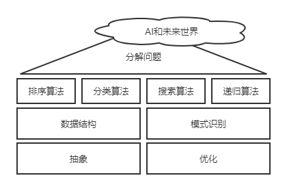

# 未来算法：下一个十年赢在计算思维

算法是打开未来世界的钥匙，是计算思维的核心概念。

计算思维就是说计算机怎么解决世界的问题，包含几个部分：

- 把复杂的问题分解成简单问题
- 找出重复的模式，包物理世界的信息抽象表示成计算机能够理解的信息和很多约定俗成的算法

计算机强大的地方在于它的规模

计算思维包含4个方面

- [ ] 分解问题
  - [ ] 拆解问题
- [ ] 抽象
  - [ ] 人生活在一个物理世界中，计算机生活在一个数字世界里
  - [ ] 如果钻进计算机里，看到就是“0”和“1”的世界
- [ ] 算法
  - [ ] “简单”代表“快，”优雅“代表”小“，快而小，是算法的终极目标
- [ ] 模式识别
- [ ] 优化
  - [ ] 优化问题有优化空间，优化效率，优化速度，优化资源等
  - [ ] 优化的精髓是要在有限的时间内，用有限的资源找到针对于一个问题的可以接受的解决方案。优化往往追求时间和空间的平衡计算机和人一样，不总能做到最好，因为它有时间和空间的限制

本书得到最关键的知识：**洞察力**，那个被计算机和算法轻车熟路地操纵着的未来世界



**时间管理九十把所有事装到所有时间里**

```python
时间管理法：
1.写下明天要做的6件最重要的事
2.用数字标明每件事的重要性次序
3.明天早上第一件事情是做第一项，直至完成或达到要求
4.然后再开始完成第二项，第三项。。。
5.每天这样做，养成习惯
```

```shell
如果感到焦虑，可以试一试下面的三步法：
1.坐下来把你想到的所有事情写下来，然后分类为“我能影响”和“我不能影响”
2.对于“我能影响”的那些事情，你可以积极主动去改变
3.对于“我不能影响”的事情，问问自己“我能做些什么"
```

|        | 紧急                                     | 不紧急                                       |
| ------ | ---------------------------------------- | -------------------------------------------- |
| 重要   | 危机事件 迫切问题 临近截止时间的重要任务 | 建立长期关系，培养能力，看新的机会           |
| 不重要 | 临时访客，电话，邮件，很多会议           | 琐碎的事情，消磨时间的活动，漫无目的的刷手机 |

**如果你一直求而不得，可以做下面几件事：**

- [ ] 想一想你锁定的范围是否正确
- [ ] 扩大你的搜索空间
- [ ] 调整你的搜索条件

编码是把文字、图像等对应生成数字码的过程，编码的方法显然不是唯一的，编码的好坏会影响信息存储和使用的效率

在物理世界的基础上，创造出一个崭新、完美、精确的数字世界，计算机就是这个数字世界的基石

**5G时代，VR和AR是能够彻底颠覆传统人机交互内容的变革性技术，将人类的物理世界和虚拟世界的界限进一步打破**

*当你清楚地定义一个问题的时候，你已经解决了百分之九十了*

寻找简单有效的（而不是更复杂，更昂贵的解决方案）解决方案可以到达最佳效果

