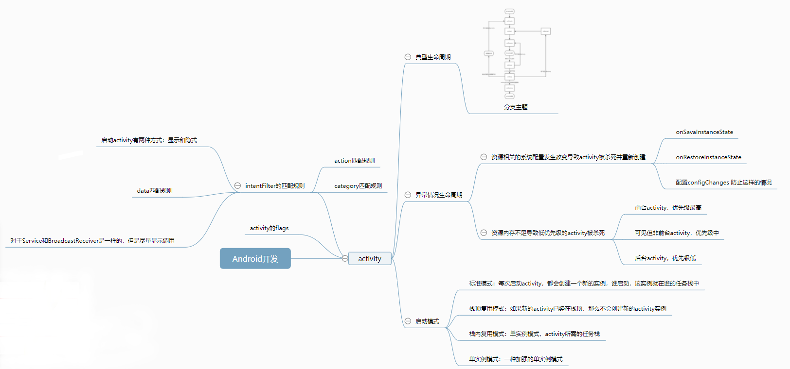

# Android开发

## view的事件体系

### 基础概念

| view的位置参数  | view在平移的过程中，top和left表示的是原始左上角的位置信息，其值不会变，此时改变的是x,y,translationX,translitionY |      |
| --------------- | ------------------------------------------------------------ | ---- |
| motionEvent     |                                                              |      |
| TouchSlop       | 系统能识别出的被认为是滑动的最小距离                         |      |
| VelocityTracker | 速度追踪：用于追踪手指在滑动过程中的速度                     |      |
| GestureDetector | 手势检测：用于辅助检测用户的单击、滑动、长按、双击等行为     |      |
| Scroller        |                                                              |      |
|                 |                                                              |      |

### view的滑动

- 通过view本身的scrollTo、scrollBy来实现
  - 只能改变view内容的位置而不能改变view在布局中的位置
- 通过动画给view施加平移效果来实现滑动
  - 控件的位置信息并不会随着动画而改变，解决办法：使用属性动画
- 改变view的LayoutParams是的view重新布局来实现

### 弹性滑动

### view的事件分发机制

### view的滑动冲突

## IPC机制

它的进程间通信方式并不能完全继承自LInux，它有自己的进程间通信方式

*Binder*

- 跨进程通信的方式
- 虚拟的物理设备 、/dev/binder
- 连接各种Manager的桥梁
- 客户端和服务端的通信媒介
- 工作流程

多进程模式：

- 开启方式：在四大组件中的AndroidMenifest中指定Android：process属性
- Android系统给每一个应用分配一个唯一的UID，具有相同的UID的应用才能共享数据
- 运行在不同的进程中的四大组件，只有他们之间需要通过内存来共享数据，都会失败

多进程模式的影响：

- 静态成员和单例模式完全失效
- 线程同步机制完全失效
- sharedPreference的可靠性下降
- application会多次创建

方式：

|      |                     |
| ---- | ------------------- |
|      | 使用bundle方式      |
|      | 使用文件共享        |
|      | 使用messenger       |
|      | 使用ALDL            |
|      | 使用contentProvider |
|      | socket              |

## activity

