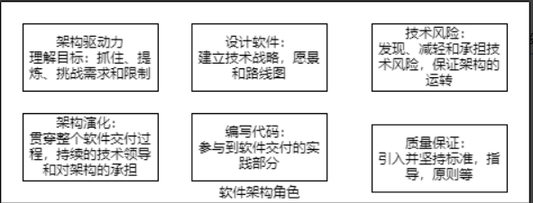
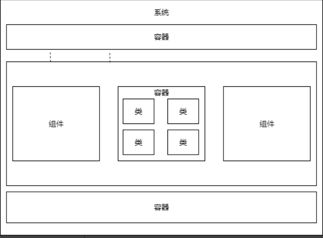

# 程序员必读软件架构

从现在开始，认真且有效地去规划完成自己负责的事情

关于软件架构，开发者的五件事情

- [ ] 软件架构不是大型预先设计
- [ ] 每一个软件团队都需要软件架构
- [ ] 软件架构的角色关乎编码、指导和合作
- [ ] 无需使用UML
- [ ] 好的软件架构是支持敏捷开发

软件架构：

架构和设计的区别：所有架构都是设计，但并非所有设计都是架构

软件架构角色：

最好的设计和最好的技术简单的平凑在一起，并不意味着整个架构会成功

能进行那么多种类型的测试，为什么不对架构也这样做呢？如何架构能测试？

要认识到：没有办法保证每一件事情，毕竟“知”和“行”是两回事

技术不是一个实现细节，你需要理解为自己决定所做的取舍

如果设计软件、画架构图回答不了架构是否行之有效，那么他们可能不是这项工作的合适人选

需求驱动架构

在工作之外，可以从贡献开源代码等保持编码技能

作为个人，我们要清楚自己的经验水平，以及为了提升它我们需要关注什么

软件开发不是接力运动，顺利交付也不是“实现细节”

软件开发者

- 了解大局
- 挑战架构决策
- 申请参与

对业务领域的了解可以帮助你更好地理解目标和建立成功的软件产品

凡事皆有可能，但每一件事情都有代价，解释那些代价有助于找到给定语境中的最好方案

现实世界就有约束，约束可以驱动，塑造和影响软件系统的架构

最终交付的只有代码，但如果要向别人解释系统如何工作？你一上来就说代码？----代码并非全部

C4图：

- 语境

- 容器

  - 软件系统的整体形态是什么样的
  - 高层次技术决策有哪些
  - 职责在系统中如何分布
  - 容器之间如何相互交流
  - 为了实现特性，需要在哪里写代码

- 组件

- 类

  *考虑把辅助文档作为一个不断变化的旅游指南，而不是一个综合的静态历史片段*

  

架构结构的简单模型：

