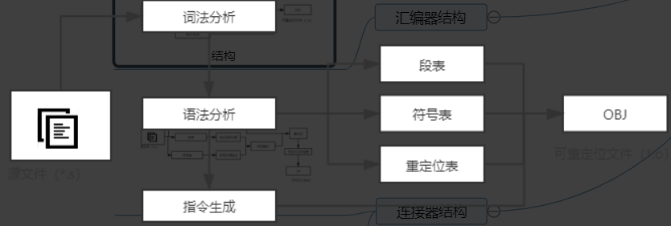

# 自己动手构造编译系统

-----

github代码地址：fanzhidongyzby/cit

----

链接器使得计算机能自动把不同的文件模块准确无误地拼接起来，使得代码复用成为可能

运行时链接的方式会增加程序执行的时间开销

由于汇编器在处理当前文件的过程中无法获悉符号的虚拟地址，因此临时将这些符号地址设置为默认值0，真正的符号地址只有在链接的时候才能确定

## 理解ELF文件的结构和组织

描述linux下可执行文件、可重定位目标文件、共享目标文件、核心转储文件的存储格式

文件格式：

段表记录了elf文件内所有段的位置和大小等信息

可执行文件其实就是按照一定标准将二进制数据和代码等信息包装起来，方便操作系统进行管理和使用

## 编译器是编译系统的核心

符号表是记录符号信息的数据结构，它使用按名存取的方式记录与符号相关的所有编译信息

现代编译器的设计：

1. 前端
2. 优化器
3. 后端

## 汇编器结构

## 连接器结构

三大功能：

1. 地址空间分配
   1. 为段指定地址
2. 符号解析
   1. 为段内符号指定地址
3. 重定位
   1. 地址修正

