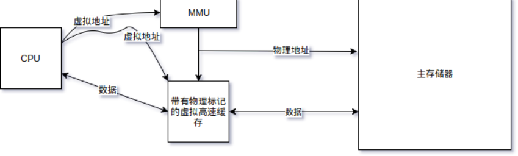
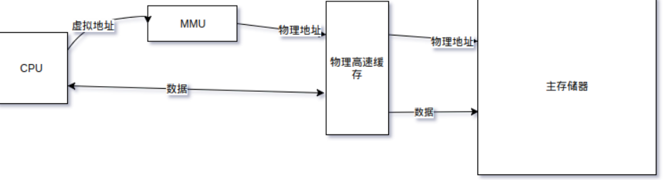

# 现代体系结构上的Unix系统-对称处理器和缓存技术

## 基础知识

- 所有的系统活动都发生在进程内部，这一规则的一种例外情况就是中断处理程序
- 第二种情况就是流（stream）服务过程
- 进程的地址空间
  - 程序指令
  - 初始化数据
  - 未初始化数据
  - 栈
- 用户正文和数据段的大小在编译的时候已经固定了，他们只能在执行程序的时候，从包含程序的文件中复制到地址空间中

## 多处理器系统

- MP的每一种实现都要解决3个问题
  - 系统完整性
  - 性能
  - 外部编程模型
- 互斥类型
  - 短期互斥
  - 带有中断的互斥
  - 长期互斥
- 原语
  - 所有的原语不是提供互斥机制，就是提供同步机制，或者两者皆有
  - 主要差别：在特殊场合中的方便性或者灵活性

## 带有高速缓存的多处理器系统

- 协议
  - 写-使无效
  - 写-更新

## 高速缓存存储系统

- 4种常见的高速缓存实现
  - 虚拟高速缓存
    - 操作系统最难以管理的高速缓存类型
    - 以虚拟地址作为标记
  - 带有键的虚拟高速缓存
    - 采用进程键的目标是减少必须出现的冲洗操作次数，以及在上下文切换过程中保持一个进程的引用局部性
    - 共享的数据在高速缓存中不能共享
  - 带有物理地址标记的虚拟高速缓存
    - 消除歧义，而且还有可能共享高速缓存中的数据
    - 
  - 物理高速缓存
    - 
  - 这四种实现在各种情况下的优缺点
    - 上下文切换
    - fork
    - exec
    - exit
    - brk和sbrk
- 分类
  - 直接映射高速缓存
    - 高速缓存行在被再次命中之前总是被替换掉，称为高速缓存颠簸
  - 双路组相联高速缓存
    - 减少直接映射缓存中两个不同地址经散列计算得出相同索引发生的高速缓存颠簸
  - n路组相联高速缓存
  - 总结
    - 每一种组织结构都有一种用于选择搜索行的算法，一种替换算法，都可以使用写直通或者写回策略
    - 主要区别在于每一组内行数的不同
- 高速缓存冲洗形式
  - 使主储存器有效
  - 使高速缓存无效
- 各种高速缓存的差异
  - 缓存大小
  - 行大小
  - 组大小
  - 写分配的使用
  - 替换策略
  - 通过虚拟地址还是物理地址来查找
  - 如何标记行（通过虚拟地址还是物理地址？
  - 写直通还是写回策略
- 整体性能依赖的因素
  - 高速缓存的物理设计
  - 系统上运行的程序的局部引用特性
  - 操作系统管理高速缓存的效果
  - 提高性能的3种技术
    - 地址空间布局
      - 影响到高速缓存的利用率和高速缓存行的竞争
    - 延迟高速缓存无效
      - 所有的高速缓存冲洗操作都受限于高速缓存的大小
    - 缓存对齐的数据结构
      - 整合特定局部引用的数据，使其正好与单行高速缓存相吻合

## 额外的资料

- 多处理器编程的艺术
- Is Parallel Programming Hard, and if so, what can you do about it?
- rootkit:系统灰色地带的潜伏者

