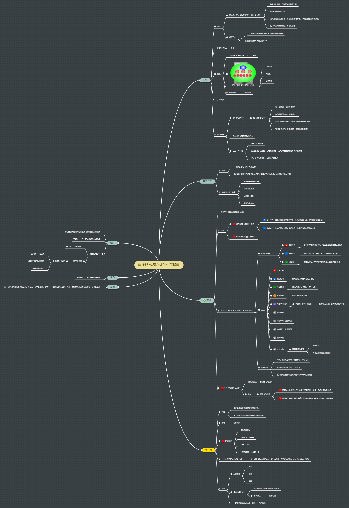

# 软技能-代码之外的生存指南

## 职业

- 心态
  - 没有把自己的软件事业当作一桩生意来看待
    - 和中世纪小镇上开铁匠铺的铁匠一样
    - 我们的技能还是自己
    - 只有开始把自己当作一个企业去思考时候，你才能做出良好的决策
    - 你的工资还真不是取决于你的表现
  - 转变心态
    - 把雇主当作你的软件开发企业中的一个客户
    - 你能提供的服务就是创建软件
- 把职业当作是一个企业
- 目标
  - 为你的职业生涯设置至少一个大目标
  - 把大目标分解为相应的小目标
    - 
  - 追踪目标
    - 每日总结
- 人际关系
- 跻身阶梯
  - 承担更多的责任
    - 如何承担更多责任
      - 有一个项目，你能去负责？
      - 帮助团队里的新人快速成长？
      - 负责文档制作流程，并保证及时更新这些文档？
      - 哪项工作没有人意愿去做，你愿意承担起来？
  - 看似没有克服不了障碍的人
  - 建立一种机制
    - 追踪自己的时间
    - 历史上许多最血腥，最残酷的战争，在某种程度上都是为了宗教而战
    - 恪守教条的信仰往往有很大的煽动性

## 自我营销

- 目标
  - 实现价值在先，要求回报在后
  - 学习如何控制好自己要传达的信息，塑造好自己的形象，扩展信息送达的人群
- 大招品牌四大要素
  - 品牌所要传递的信息
  - 品牌的视觉符号
  - 品牌的一致性
  - 品牌的曝光率

## 学习

- 学会学习是自我教育的核心功能
- 疑问
  - 思考过自己如何学习的？
    - 把一本关于编程语言或框架的技术书，从头到尾读一遍，能吸收所有的信息？
    - 这种方式，快速积累该主题的全部信息，但是仍然没有真正学会它
  - 学习的真正的含义是什么？
- 十步学习法：聚焦学习范围，关注重点内容
  - 如何掌握一门技术？
    - 如何开始
      - 要开始使用自己所学的，我需要掌握哪些基本知识？
    - 学科范围
      - 我所学的东西，学科有多大，我该如何怎么做？
    - 基础知识
      - 需要知道自己学的哪些20%能满足80%的日常应用
  - 方法
    - 了解全局
    - 确定范围：将大主题分解为可控的子主题
    - 定义目标：好的目标应该是具体，无二义性
    - 寻找资源：图书，评分高的图书
    - 创建学习计划
      - 打造自己的学习计划
      - 观察别人是如何教你感兴趣的主题
    - 筛选资源
    - 开始学习，浅尝而止
    - 动手操作，边写边玩
    - 全面掌握
    - 乐为人师
      - 遇到强悍的问题
        - 为什么？
        - 为什么这样就是对的呢？
  - 犯的错误
    - 在知之不多的情况下，盲目开始，行动太快
    - 在行动之前准备过多，行动太晚
    - 根据他人的生活来判断其是否有帮助我们的能力
- 为什么我们会有短板
  - 我们总是倾向于掩饰自己的短板
  - 办法
    - 找出你的短板
      - 看看自己在哪些工作上花费大量的时间，或者一直进行重复性劳动
      - 试图去了解自己不理解或者不清楚的事物，维护一份清单，追踪这些

## 生产力

- 专注
  - 生产效率高并不能保证你是高效的
  - 每天能够专注完成的工作量才是最重要的
- 书籍
  - 看板实战
- 定额实例
  - 每周跑步3次
  - 每周发布一篇博客
  - 每天写一章
  - 每周完成50个番茄的工作
- 什么才是真正的多任务并行
  - 将一项不费脑筋的任务和一项一定程序上需要精神专注才能完成的任务组合起来
- 习惯
  - 三大要素
    - 暗示
    - 惯例
    - 奖励
  - 造成拖延的原因
    - 大型任务给人带来沉重的心理辅导
    - 解决办法：分解任务
  - 一切有价值的东西无不一是努力工作的结果

## 理财

- 许多关键决策很大程度上是以财务状况为基础的
- 了解每一个月自己的钱都花在哪儿了
- 拒绝短期思维
  - 挣得越大，花的越大
  - 资产和负债
    - 关于债务的错误
      - 一边欠债，一边还钱
      - 以错误的顺序偿还债务
      - 没有必要的债务

## 健身

- 人的身体是人的灵魂的最好写照

## 精神

你不能把别人说的话当作福音，没有人可以垄断真理，现实中，正是你发现了真理，这并不意味着你可以忽视这世界上的公认真理

