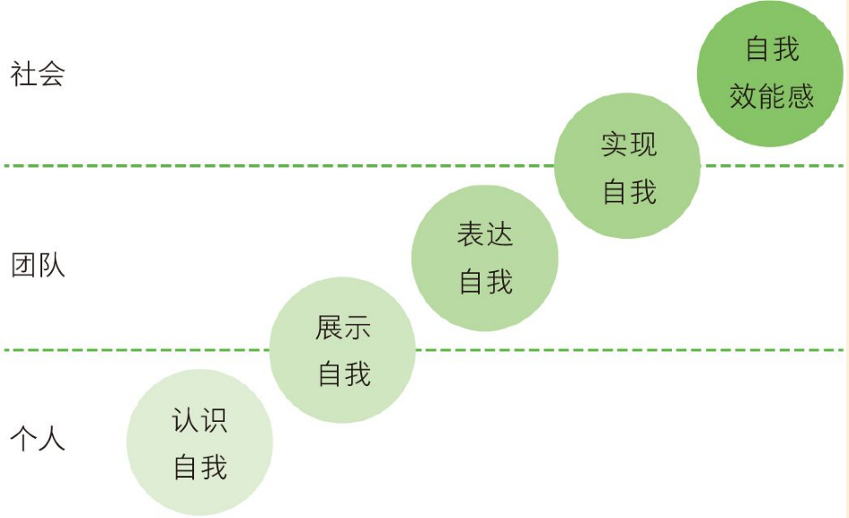
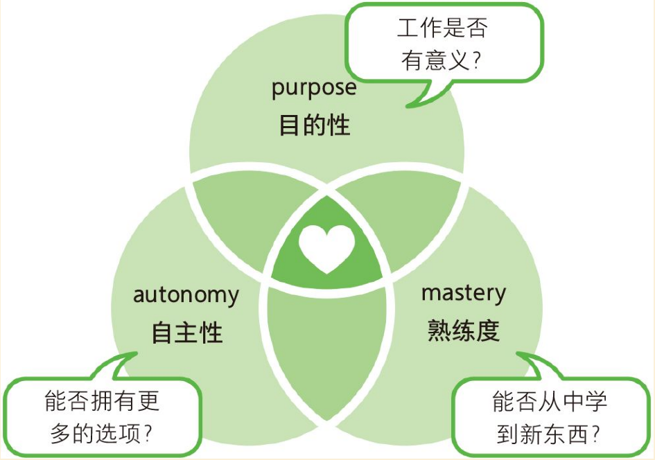
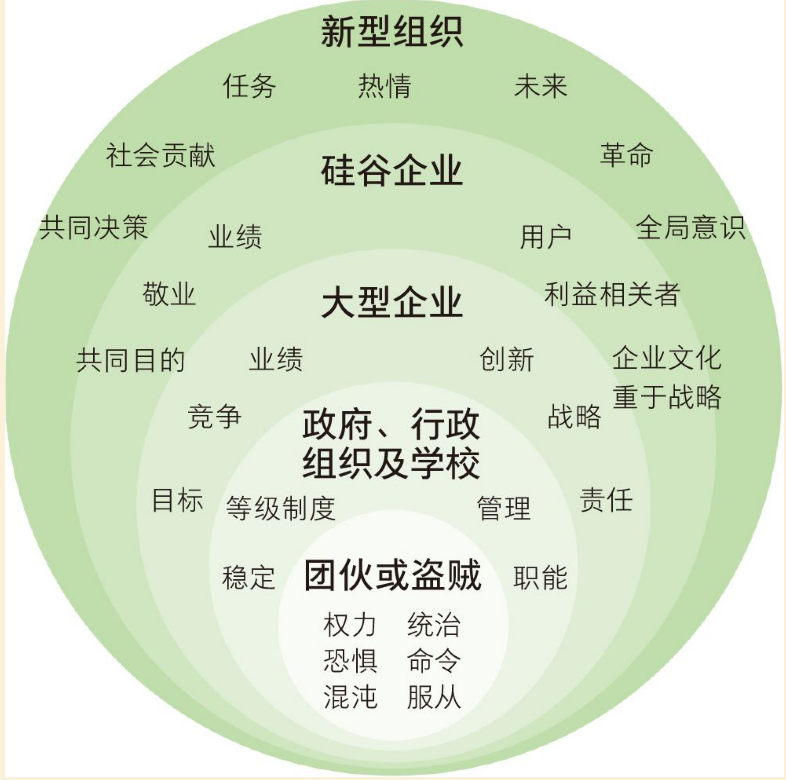

# 如何管理10人以下小团队

管理团队的很多基本原理是全球通用，其中最重要的一点是员工的安全感，安全感是指员工既能发挥自己的独特风格，又能参与团队协作的感受，所有业绩出众的团队都会将成员的安全感视为重中之重

卓越管理者的8项特质：

- [ ] 当一个好教练
  - [ ] 目标（goal）：你要达到那些目标？
  - [ ] 现状（Reality)：目前进展如何？
  - [ ] 解决方案（Option）：有哪些方案？
  - [ ] 行动计划（Will）：打算怎么办
- [ ] 鼓舞团队，杜绝微观管理（过度监督和干预团队成员）
- [ ] 高度关注成员的健康和工作成果
- [ ] 注重产出，坚持绩效注意
- [ ] 做团队的聆听者，积极与成员沟通
- [ ] 帮助成员进行职业规划
- [ ] 为团队制定清晰的前景和战略
- [ ] 拥有专业知识和技术，能为成员提供建议

如何评价团队效率？

按照谷歌定义，团队不单纯是员工一起工作的集体，而是拥有目的性和战略性、能够长期保持共同行动的集体，在团队中，成员们需要共同规划、一起解决问题，定期回顾和反省自己的工作情况

管理者必须与直属上司一起，思考公司的高层经营者如何评价这个团队的

高效率团队的特征：

- [ ] 团队成员拥有“安全感”
- [ ] 成员认为团队具有“可靠性“
- [ ] 团队结构清晰
- [ ] 团队的工作有意义
- [ ] 成员认为团队的工作能对社会带来影响

**创造合适的环境，让每一个成员放下顾虑，按照自己的风格工作，并能认知自我，展示自我和表达自我，就是管理者最重要的职责**

心理咨询的基本前提：不附加任何提交、积极接纳对方

坚持性善论并非难事，只需要乐观地相信**得人以善者必还之以善**

领导力的根基：平易近人（谦逊）

团队的成员与管理者之间是伙伴的关系，因为人无完人，人必须要有彼此扶持的伙伴

管理者需要做的调解不是单方面提出解决方案，而是不懂声色地让当事人说出自己的意见

从认识自我到自我效能感的转变

管理者最起码应尽到的3个职责：

- [ ] 制定团队的任务（愿景和战略）
- [ ] 管理完成任务的过程
- [ ] 培养成员

当目的性、熟练度和自主性这三个因素都得到满足时，员工会拥有更大的工作动力。如下图

正念的核心：每时每刻都活在当下

在向前奔跑的同时，思考现在发生了什么，为什么会发生，如何改善现状

除了学什么，怎么学也变得越来越重要，因此学习敏锐度和成长型思维具有重要意义

工作中总有一些煎熬、痛苦的时刻，也就是黑暗部分

**任何团队任务归根结底都是要创造价值**

千万不要畏惧，在如今这个世界上，随便哪里都能找到发挥自己能力和潜力的舞台

