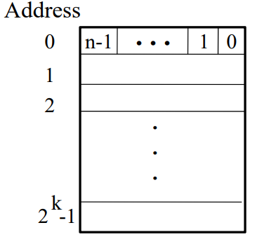
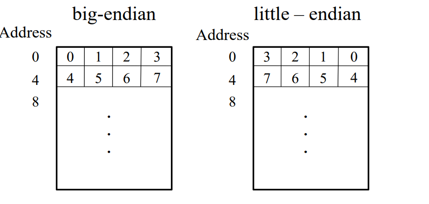

# 从底层看待代码


## 代码存储

[^https://www2.ece.ohio-state.edu/~zheng/ece5362/lecture-notes/Lecture5.pdf]: 来源整理

内存位置、地址、指令和指令排序

*数据、指令在主存中是如何组织的？内存是如何处理（寻址模式）？*

1Byte=8bits

| 地址总线 k | 内存大小                          |
| ---------- | --------------------------------- |
| 10         | 2^10=1024(Byte)=1K                |
| 20         | 2^20=1 048 576(byte) = 1M         |
| 32         | 2^32=2^10 * 2^10 *2^10 * 2^2 = 4G |

n:表示数据总线，每个数据单元含有多少位（bits)，n = 8 或 n = 16 或 n = 32



- [ ] 这里用 编译后的ELF文件 show 十六进制的文件 截图出来

考虑每个可以存储的位置都有32位长字，也就是如下图：

| Byte | Byte | Byte | Byte |
| ---- | ---- | ---- | ---- |

-------

两种不同寻址方式



----

寄存器

指令集设计


x86-64(也称为x64和/或AMD64)是x86/IA32指令集的64位版本，下表列出了常用的寄存器(16个通用寄存器加上两个专用寄存器)。每个寄存器64位宽;下面的32位、16位和8位部分可以通过伪寄存器名来选择。

[来源]: https://web.stanford.edu/class/archive/cs/cs107/cs107.1174/guide_x86-64.html


| Register | Conventional use                | Low 32-bits | Low 16-bits | Low 8-bits |
| -------- | ------------------------------- | ----------- | ----------- | ---------- |
| `%rax`   | Return value, caller-saved      | `%eax`      | `%ax`       | `%al`      |
| `%rdi`   | 1st argument, caller-saved      | `%edi`      | `%di`       | `%dil`     |
| `%rsi`   | 2nd argument, caller-saved      | `%esi`      | `%si`       | `%sil`     |
| `%rdx`   | 3rd argument, caller-saved      | `%edx`      | `%dx`       | `%dl`      |
| `%rcx`   | 4th argument, caller-saved      | `%ecx`      | `%cx`       | `%cl`      |
| `%r8`    | 5th argument, caller-saved      | `%r8d`      | `%r8w`      | `%r8b`     |
| `%r9`    | 6th argument, caller-saved      | `%r9d`      | `%r9w`      | `%r9b`     |
| `%r10`   | Scratch/temporary, caller-saved | `%r10d`     | `%r10w`     | `%r10b`    |
| `%r11`   | Scratch/temporary, caller-saved | `%r11d`     | `%r11w`     | `%r11b`    |
| `%rsp`   | Stack pointer, callee-saved     | `%esp`      | `%sp`       | `%spl`     |
| `%rbx`   | Local variable, callee-saved    | `%ebx`      | `%bx`       | `%bl`      |
| `%rbp`   | Local variable, callee-saved    | `%ebp`      | `%bp`       | `%bpl`     |
| `%r12`   | Local variable, callee-saved    | `%r12d`     | `%r12w`     | `%r12b`    |
| `%r13`   | Local variable, callee-saved    | `%r13d`     | `%r13w`     | `%r13b`    |
| `%r14`   | Local variable, callee-saved    | `%r14d`     | `%r14w`     | `%r14b`    |
| `%r15`   | Local variable, callee-saved    | `%r15d`     | `%r15w`     | `%r15b`    |
| `%rip`   | Instruction pointer             |             |             |            |

- [ ] 这里可以截图 目前linux上的寄存器


由于其CISC特性，x86-64支持多种寻址模式。寻址模式是一个表达式，它计算内存中要读/写的地址。这些表达式被用作mov指令和其他访问内存的指令的源或目标。下面的代码演示了如何在每个可用寻址模式的例子中，将即时值0写到不同的内存位置:

```assembly
movl $0, 0x604892            # direct (address is constant value)
movl $0, (%rax)              # indirect (address is in register %rax)

movl $0, -24(%rbp)           # indirect with displacement (address = base %rbp + displacement -24)

movl $0, 0xc(%rsp, %rdi, 4)  # indirect with displacement and scaled-index
                              (address = base %rsp + displacement 0xc + index %rdi * scale 4)

movl $0, (%rax, %rcx, 8)     # (special case of scaled-index, displacement assumed 0)

movl $0, 0x8(, %rdx, 4)     # (special case of scaled-index, base assumed 0)

movl $0, 0x4(%rax, %rcx)      # (special case of scaled-index, scale assumed 1)
```

**各种指令**

- [ ] 这里存在一个疑问，如何统计一个elf文件中的所有指令数，并进行分布？

-----

**汇编和gdb**

- [ ] 调试gdb，在使用coredump的时候？从崩溃的地址 查看汇编

```assembly
(gdb) p $rsp
(gdb) info reg
```

```assembly
(gdb) disassemble main        // disassemble and print all instructions of main
(gdb) x/8i main               // disassemble and print first 8 instructions of main
```

```assembly
(gdb) b *0x08048375
(gdb) b *main+7               // break at instruction 7 bytes into main
```

```assembly
(gdb) stepi
(gdb) nexti
```

-----

程序调用约定

- [ ] 如何压栈？
- [ ] 如何调用程序出栈？

[这里调用约定]: https://cs61.seas.harvard.edu/site/2018/Asm2/

