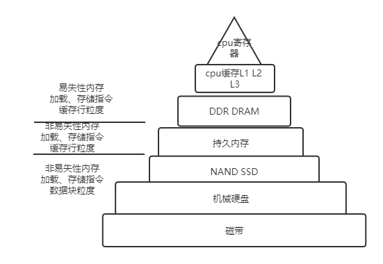
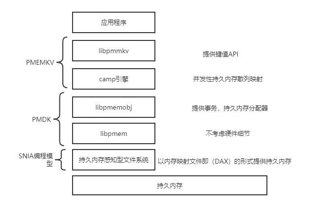
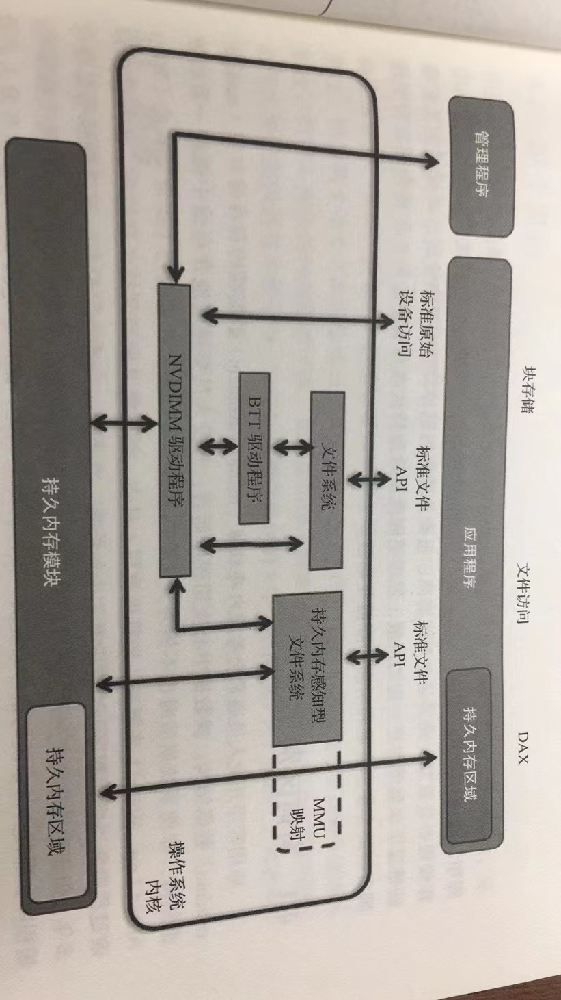

## 为什么需要持久内存
传统的内存-存储架构是由内存加硬盘所组成的两级存储，大容量持久化存储主要机械硬盘或固态硬盘来承担，高性能处理计算则交由动态随机访问内存承担。

持久内存是内存领域革命性的技术，从根本上颠覆了传统的内存-存储架构

持久内存通常被称为非易失性内存（NVM）或存储级内存（SCM）

+ 什么是持久内存？
+ 如何使用持久内存？
  + 可以使用哪些API和库？
+ 持久内存为应用程序提供哪些优势？
+ 需要学习哪些新的编程方法？
+ 如何设计应用程序以使用持久内存？

## 持久内存的好处
- [ ] 持久内存的性能
- [ ] 支持持久内存的应用程序可原地更新数据，无须对数据进行序列化/反序列化处理
- [ ] 数据与CPU缓存一致
- [ ] 写入持久内存的数据不会在断电后丢失


### PMDK
 英特尔开源持久内存开发套件，[pmdk](https://pmem.io/pmdk),pmdk 是一套基于存储网络工业协会（SNIA）NVM编程模型的开源库和工具

 本书的源代码链接 [代码](https://github.com/Apress/programming-persistent-memory)

## 性能差异



 ## 持久内存开发套件

|  易失性库   | 持久性库  | 工具和命令程序 |
|  ----  | ----  | --- |
| libmemkind  | libpmem |  pmempool  |
| libvmemcache  | libpmemobj | pmemcheck |
| libvmen  | libpmemobj-cpp | pmreorder |
|    |  libpmemkv  |   |
|    |  libpmemlog |  |
|    |  libpmemblk  |   |

### libpmemkv的软件栈



###  持久内存感知型文件系统
操作系统的一项扩展是支持文件系统感知并针对持久内存进行优化，能够支持持久内存感知的文件系统包括linux **ext4和XFS**，以及windows **NTFS**

### 内存映射文件
```
mmap() 
MapViewOfflie()
```

### 持久内存直接访问
操作系统中的持久内存直接访问特性使用内存映射文件接口，持久内存可以原生地映射应用程序内存，因此操作系统无须在易失性主存中缓存文件

> DAX编程



### 持久内存编程的基本概念

#### 原子更新
每个支持持久内存的平台都有一套具备原子性的原生内存操作

#### 事务
事务指多个操作合并到单个原子操作中

- [ ] 原子性
- [ ] 一致性
- [ ] 隔离性
- [ ] 持久性

### 各个库的作用
- [ ] libmemkind: 构建在jemalloc之上的用户可扩展堆管理器
- [ ] libvmemcache：嵌入式轻量级内存缓存解决方案
- [ ] libpmemlog: 能够实现持久内存仅可追加的日志文件，并且支持断电保护操作

