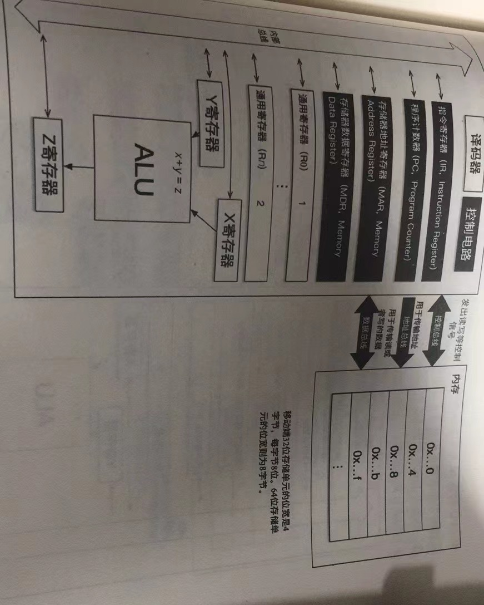

# 以几何向量理解线性代数
利用线性代数的知识，可以描述人眼中核手机内两套坐标系的关系，还能从其中一个坐标系推导出另一个

**有了基向量，就有了坐标系，如果改变基向量，由基向量组合而成的空间或者整个坐标系就会发生根本性改变，可能是在原来状态上的拉伸、压缩、或者旋转**

*移动端设备的运算能力比较弱，并不适合运行所有的神经网络结构*

优化移动端神经网络结构，需要在尽量保持精度的前提下关注两个方向：
+ 模型体积压缩
  + 减少参数量
    + 剪枝
  + 适当改变参数的数据类型
    + float -> int_8
+ 运算量降低

# ARM CPU 组成

## 现代计算机与ARM CPU架构的现状

SOC:将计算机中的CPU、GPU、内存集成到一块指甲盖大小的芯片

## 简单的CPU模型

+ 取指过程
+ 译码过程
+ 执行过程
+ 回写过程

## 汇编指令初探

CISC（复杂指令集）
RISC（精简指令集）
两者就是，CISC一条指令就像一本“长篇小说”，导致相同的程序，RISC编译出来的体积就是大，但是能更好的使用指令流水等优化手段

## 汇编指令概括

## ARM指令集架构

+ Cortex-A系列
  + ARMv7-A 
  + ARMv8-A
+ Cortex-R系列
  + Cortex-R7
  + cortex-R5
+ Cortex-M系列

# 存储金字塔与ARM汇编

SRAM,DRAM，DRAM需要不断通过刷电才能保持信息的存储，也就说保持0，1这样的状态

## ARM芯片的缓存设计原理

+ 简单的缓存映射结构：直接映射
+ 组相连映射

## NEON指令

一种SIMD，单指令多数据的指令并行技术

# 移动端CPU性能优化

## 工具以及体积优化
好的工具支持性能优化：
+ GDB
+ gprof
+ systrace

## 通用优化

算子融合

循环张开

### 编译选项优化

### 内存性能和耗电量优化

### 并行优化与流水线重排

### 卷积优化方式

winograd

gemm

# 异构GPU编程

